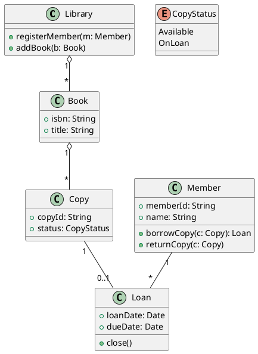
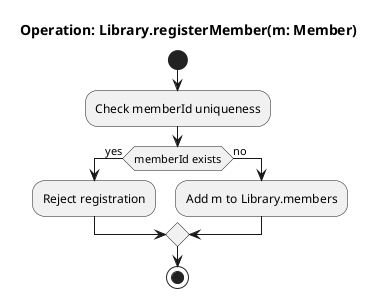
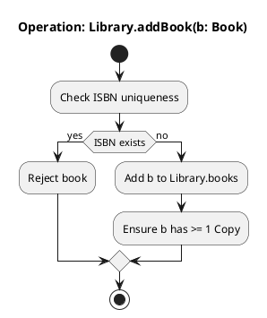
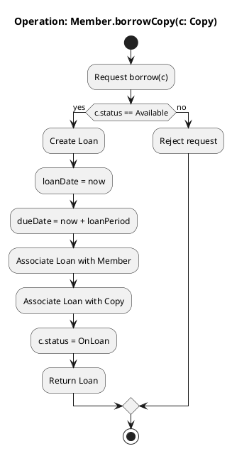
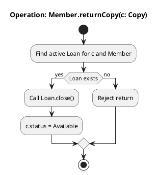
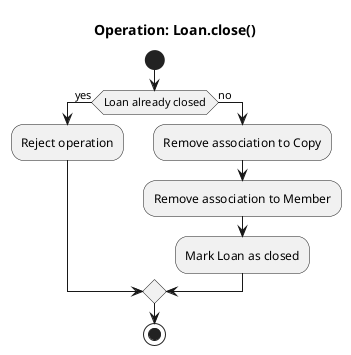

# Airline

## Class diagram

## Activity diagram for `Library.registerMember(m: Member)`

## Activity diagram for `Library.addBook(b: Book)`

## Activity diagram for `Member.borrowCopy(c: Copy)`

## Activity diagram for `Member.returnCopy(c: Copy)`

## Activity diagram for `Loan.close()`

